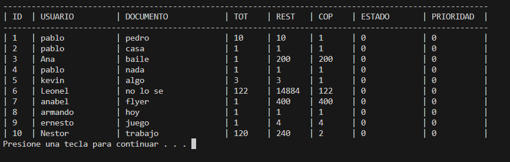
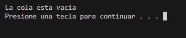
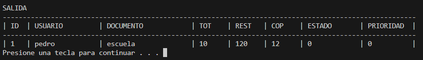
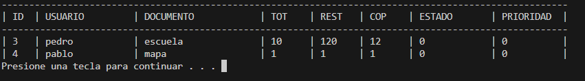

# Reporte de Actividad — Sistema de Cola de Impresión

## 1. Introducción

El objetivo de esta actividad fue desarrollar un sistema que simule una cola de impresión utilizando estructuras de datos en C.

Una cola es una estructura de datos que sigue el principio **FIFO (First In First Out)**, lo que significa que el primer elemento en entrar es el primero en salir.

Este modelo es adecuado para simular impresoras porque los trabajos se procesan en el orden en que los usuarios los envían.

El sistema permite:

- Agregar trabajos de impresión
- Consultar el primer trabajo en la cola
- Eliminar trabajos
- Mostrar la cola
- Simular el proceso de impresión

---

# 2. Diseño

## Definición de PrintJob_t

```c
typedef struct
{
    int id;
    char usuario[MAX_USER];
    char documento[MAX_DOC];
    int paginas_total;
    int paginas_restantes;
    int copias;
    Estado_t estado;
    Prioridad_t prioridad;
} PrintJob_t;
```

### Explicación de campos

| Campo | Descripción |
|------|-------------|
| id | Identificador del trabajo |
| usuario | Usuario que envía el documento |
| documento | Nombre del documento |
| paginas_total | Total de páginas |
| paginas_restantes | Páginas restantes por imprimir |
| copias | Número de copias |
| estado | Estado del trabajo |
| prioridad | Prioridad del trabajo |

---

## Enumeraciones utilizadas

### Estado del trabajo

```c
typedef enum
{
    EN_COLA = 0,
    IMPRIMIENDO = 1,
    COMPLETADO = 2,
    CANCELADO = 3
} Estado_t;
```

### Prioridad

```c
typedef enum
{
    NORMAL = 0,
    URGENTE = 1
} Prioridad_t;
```

---

## Cola dinámica

### Nodo

```c
typedef struct Node_t
{
    PrintJob_t job;
    struct Node_t *next;
} Node_t;
```

### Cola

```c
typedef struct
{
    Node_t *head;
    Node_t *tail;
    int size;
} QueueDynamic_t;
```

---

# 3. Implementación

## Lista de funciones

| Función | Descripción |
|------|-------------|
| qd_init | Inicializa la cola |
| qd_enqueue | Inserta un trabajo |
| qd_dequeue | Elimina el primer trabajo |
| qd_peek | Consulta el primer trabajo |
| qd_print | Muestra la cola |
| qd_destroy | Libera memoria |
| qd_impresion | Simula la impresión |

---

# 4. Demostración de conceptos

## Alcance y duración

### Variable local

```c
PrintJob_t job;
```

Esta variable existe únicamente dentro de la función donde se declara.

### Contador de ID

```c
int id = 1;
```

Se utiliza para generar identificadores únicos, se coloca en el main para tener un rapido acceso.

### Ejemplo de variable static

```c
#define MAX_USER 32;;
```

Permite saber el maximo de caracteres que puede introducir al nombre del usuario y se tiene acceso a ella desde cualquier funcion.

---

## Memoria

### Reserva de memoria

```c
Node_t *nuevoNodo = (Node_t *)malloc(sizeof(Node_t));
```

Se usa memoria dinámica para crear nodos de la cola.

### Liberación de memoria

```c
free(aux);
```

La memoria reservada se libera al eliminar nodos o destruir la cola.

---

## Subprogramas

### Función que modifica la cola

```c
int qd_enqueue(QueueDynamic_t *q, PrintJob_t job)
```

Recibe un puntero porque modifica la estructura.

### Función que solo consulta

```c
int qd_peek(const QueueDynamic_t *q, PrintJob_t *out)
```

Usa `const` porque no modifica la cola.

---

## Tipos de datos

Se utilizan `struct` y `enum` para organizar mejor la información.

---

# 5. Preguntas del reporte

## ¿Dónde guardaste el contador de id y por qué?

El contador se guarda en una variable que se incrementa cada vez que se crea un nuevo trabajo.

Esto asegura que cada trabajo tenga un identificador único.

---

## ¿Qué función libera memoria?

La función que libera memoria es:

```c
qd_destroy()
```

Esta función recorre la cola y libera cada nodo con `free()`.

---

## ¿Qué invariantes mantiene la cola?

- size >= 0
- si size == 0 entonces head == NULL y tail == NULL
- head apunta al primer elemento
- tail apunta al último elemento

---

## ¿Por qué peek no debe modificar la cola?

Porque su propósito es únicamente consultar el primer elemento sin alterar el orden de los trabajos.

---

## ¿Cómo distinguir entre cola llena y entrada inválida?

Entrada inválida ocurre cuando los datos ingresados no cumplen las validaciones.

Cola llena ocurre cuando no se puede reservar memoria para un nuevo nodo.

---

# 6. Simulación

El progreso de impresión se simula mediante un ciclo.

```c
for (int i = 1; i < job->paginas_restantes; i++)
{
    printf("imprimiendo pagina %d / %d\n", i + 1, job->paginas_restantes);
    Sleep(300);
}
```

---

# 7. Evidencia de ejecución

## Sesión 1 — cola llena / cola vacía



Impresion de la cola llena.



Impresión de la cola vacía.

---

## Sesión 2 — FIFO y salida limpia



Salida de FIFO.



Mostrar FIFO.

---

## Sesión 3 — progreso de impresión


Estado de tarea pendiente y completada.


Impresion de trabajo en pantalla.

---

# 8. Análisis comparativo

## Cola estática

Ventajas

- Implementación simple
- Uso fijo de memoria

Desventajas

- Tamaño limitado

---
## Cola dinámica

Ventajas

- Tamaño flexible
- Puede crecer según la demanda

Desventajas

- Requiere manejo manual de memoria

---

# 9. Mejoras implementadas

libreria para la validación de entradas invalidas.

```c
int valida_int(int min, int max, const char *cadena);
char *my_gets(char *cadena, int tamano);
int getInt();

int valida_int(int min, int max, const char *cadena)
{
    int num;
    do
    {
        printf("%s", cadena);
        num = getInt();
    } while (num < min || num > max);
    return num;
}

char *my_gets(char *cadena, int tamano)
{
    size_t longitud;
    fflush(stdin);
    if (!fgets(cadena, tamano, stdin))
        return NULL;
    longitud = strlen(cadena);
    if (longitud > 0 && cadena[longitud - 1] == '\n')
        cadena[longitud - 1] = '\0';
    return cadena;
}

int getInt()
{
    char cadena[30];
    int i = 0, valor = 0;
    fflush(stdin);
    if (!fgets(cadena, sizeof(cadena), stdin))
        return 0;
    while (cadena[i] != '\0' && cadena[i] != '\n')
    {
        if (cadena[i] >= '0' && cadena[i] <= '9')
            valor = valor * 10 + (cadena[i] - '0');
        i++;
    }
    return valor;
}
```

impletentacion de tarea por prioridad (1 prioridad URGENTE).


# 10. Conclusiones

Durante esta practica aprendí lo que es una cola y como estas se comportan al introducir y sacar datos de la misma, tambien esta actividad me ayudo a comprender el uso de const para especificar que una variable no se modificara en los agurmentos de una funcion mediante el uso de const, lo cual permite una mayor legibilidad y entendimiento de las funciones.

Ademas, esta practica me ayudo a consolidar mis conocimientos del uso de memoria dinamica, y el manejo de listas, vistas en la materia de estructura de datos.