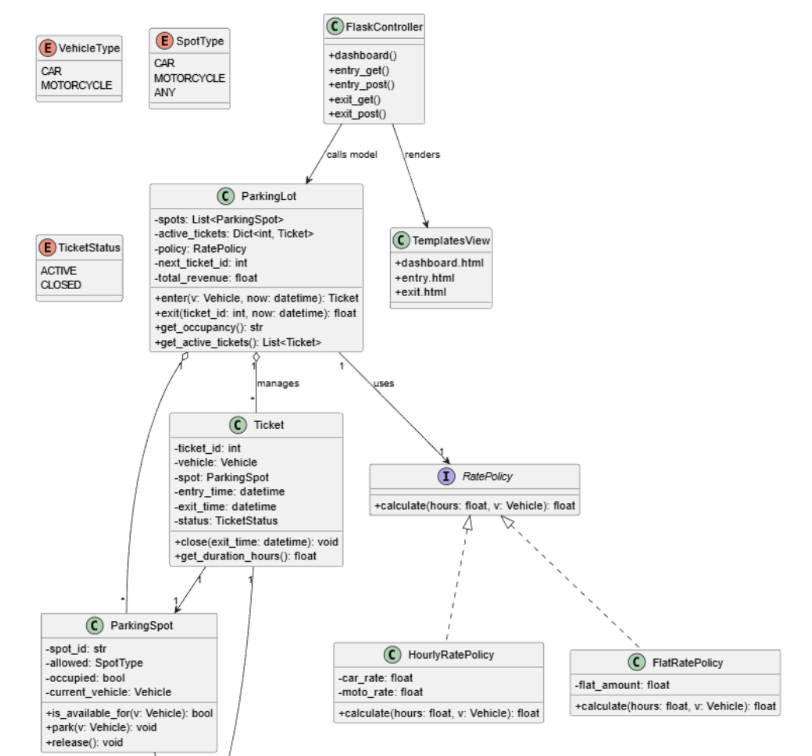
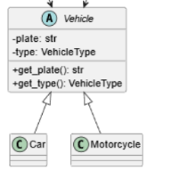
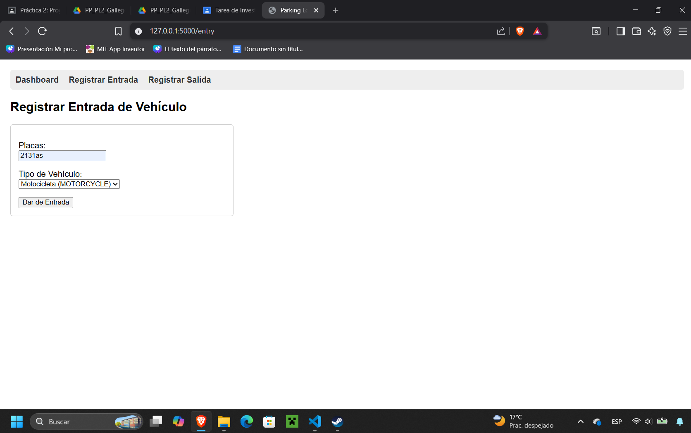
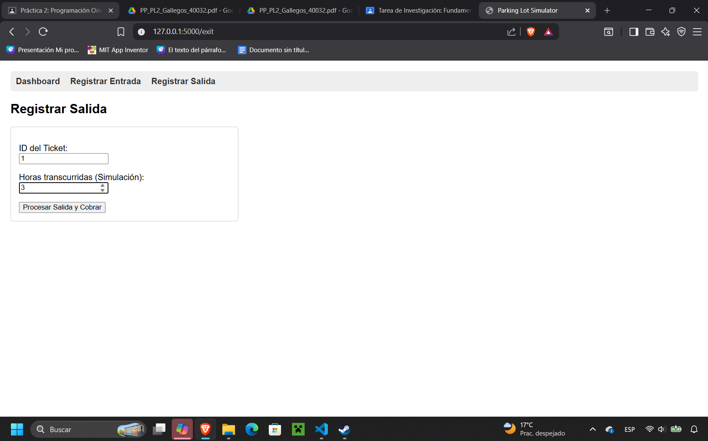
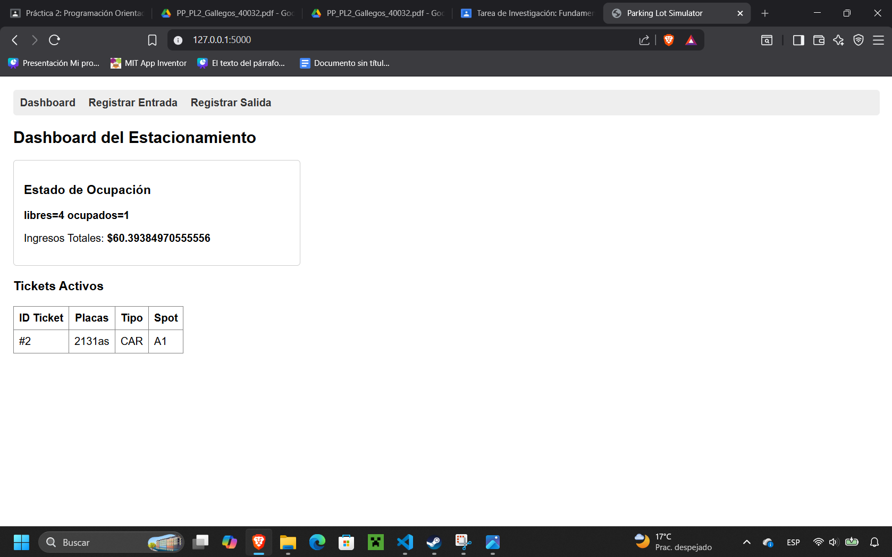
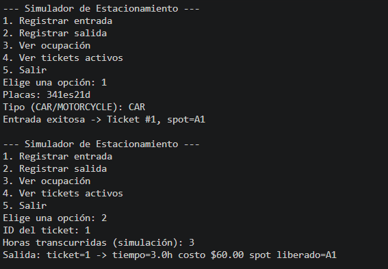
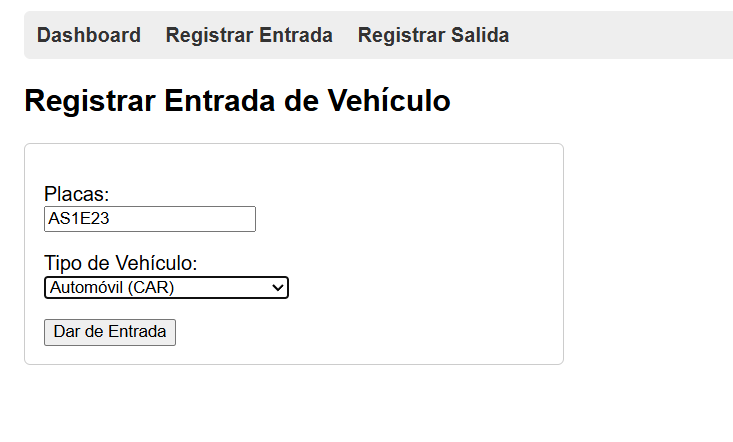
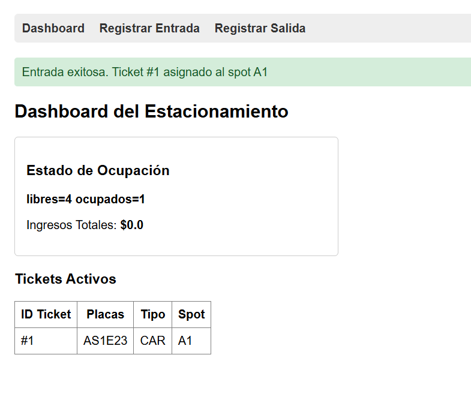
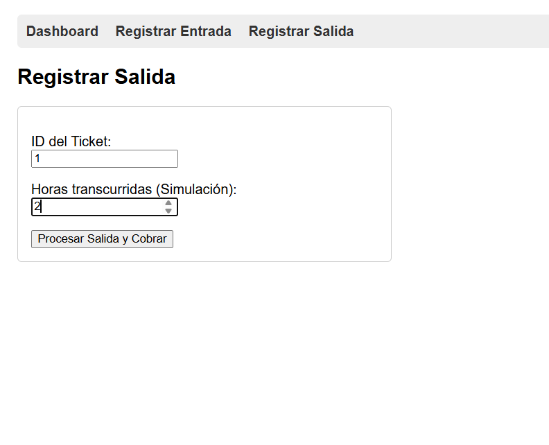
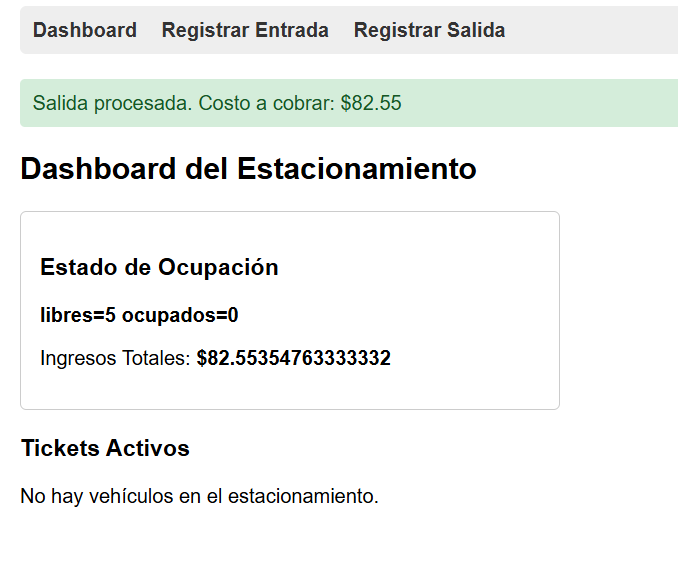

# Práctica 2

Pablo Fernando Ruiz Perez  379207

Jose Carlos Gallegos Mariscal  
3 de abril de 2026  

# 1. Introducción

En esta práctica se desarrolló un Simulador de Estacionamiento aplicando el paradigma de Programación Orientada en python.

Esta actividad fue dividida en 3 sesiones:

- Sesión 1: Modelo orientado a objetos y comportamiento básico.
- Sesión 2: Polimorfismo, subtipos y extensiones controladas.
- Sesión 3: Interfaz web con Flask.

# 2.Objetivo

Diseñar e implementar un sistema simple con las siguientes caracteristicas; modelo, encapsulación, abstracción, herencia, composición comportamiento, polimorfismo,subtipos y una interfaz web con Flask.

### 2.1. Lista de Clases y Responsabilidades
* **Vehicle**: Representa la abstracción de un vehículo con sus placas y tipo.
  
* **ParkingSpot**: Administra un lugar específico, controlando su estado de ocupación y compatibilidad.
  
* **Ticket**: Registra la transacción de entrada, vinculando el vehículo con el lugar y calculando el tiempo de estancia.
  
* **ParkingLot**: Clase principal que coordina la lógica de negocio, administra la colección de lugares y procesa ingresos/egresos.
  
* **RatePolicy**: Define la interfaz para el cálculo de costos, permitiendo separar las políticas de cobro del resto del sistema.

### 2.2. Diagrama UML


---

# 3. Evidencia de Conceptos POO
[cite_start]A continuación se presentan fragmentos de código (snippets) que demuestran la implementación de los pilares de POO requeridos[cite: 379]:

## 3.1. Encapsulación
Los atributos están protegidos y las validaciones ocurren dentro de los métodos para mantener los invariantes del sistema.

```python
# Ejemplo en ParkingSpot
def park(self, v: Vehicle) -> None:
    if not self.is_available_for(v): # Validación de invariante
        raise ValueError("El spot no es compatible o ya está ocupado.")
    self._occupied = True # Atributo privado protegido
    self._current_vehicle = v
```

## 3.2. Abstraccion
Se utiliza una interfaz para que la lógica de cobro no esté ligada directamente al sistema.

```python
# Ejemplo en ParkingSpot
class RatePolicy(Protocol):
    def calculate(self, hours: float, v: Vehicle) -> float:
```

## 3.3. Composición
La clase principal ParkingLot está compuesta por una colección (lista) de ParkingSpot y administra el ciclo de vida de los Ticket mediante un diccionario.

```python
class ParkingLot:
    def __init__(self, spots: List[ParkingSpot], policy: RatePolicy):
        self._spots = spots
        self._active_tickets: Dict[int, Ticket] = {}
```

## 3.4. Herencia y subtipos
Se implementaron las clases específicas Car y Motorcycle que heredan de la clase base abstracta Vehicle, definiendo su tipo en el constructor.

```python
class Vehicle(ABC):
    # ... métodos base e inicialización ...

class Car(Vehicle):
    def __init__(self, plate: str):
        super().__init__(plate, VehicleType.CAR)

class Motorcycle(Vehicle):
    def __init__(self, plate: str):
        super().__init__(plate, VehicleType.MOTORCYCLE)
```

## 3.5. Polimorfismo
El método calculate de HourlyRatePolicy evalúa polimórficamente el objeto Vehicle que recibe, aplicando una tarifa distinta según el tipo de vehículo en tiempo de ejecución, sin que ParkingLot conozca el tipo específico.

```python
def calculate(self, hours: float, v: Vehicle) -> float:
    if v.get_type() == VehicleType.CAR:
        return hours * self._car_rate
    elif v.get_type() == VehicleType.MOTORCYCLE:
        return hours * self._moto_rate
    return hours * 15.0 # Tarifa base
```

# 4. MVC con Flask
La arquitectura se dividió siguiendo el patrón Modelo-Vista-Controlador de forma simplificada:

Model (Modelo): Se reutilizaron las clases del dominio intactas desarrolladas en las sesiones previas (ParkingLot, Ticket, Vehicle, ParkingSpot, RatePolicy). Estas agrupan toda la lógica de negocio.

View (Vista): Se construyeron plantillas HTML mediante el motor Jinja2 (como dashboard.html y entry.html). Estas se encargan de renderizar la información de ocupación y los formularios.

Controller (Controlador): El archivo app.py funciona como enrutador. Captura las solicitudes HTTP (GET/POST), interactúa extrayendo o modificando el estado del modelo ParkingLot y finalmente invoca a las vistas usando render_template().

## 4.1. Captura de rutas y pantallas

Entrada


Salida


Dashboard


# 5. Flujos

Flujo 1:


Flujo2:





# 7 Preguntas Guía
1. ¿Qué clase concentra la responsabilidad de asignar spots y por qué?

Parking_lot, ya que es la unica que puede tener acceso a toda la imformacion necesaria para administrar el estacionamiento.

2. ¿Qué invariantes protege tu modelo? (menciona al menos 2).

El parking spot se garantiza que no puede ser ocupado por mas de un vehiculo con el atributo privado __ocuppied.

Los tickets solo pueden ser cerrados una vez, ya que estos cuentan con un metodo closed que cambie su estatus.

3. ¿Dónde se aplica polimorfismo y qué ventaja aporta en tu diseño?

Se aplica principalmente en la interfaz de cobro (RatePolicy) y en los tipos de vehículos (Car, Motorcycle). En la implementación, el método calculate de HourlyRatePolicy evalúa polimórficamente al objeto Vehicle que recibe para decidir la tarifa correcta. Por ello el codigo no es tan confuso y no necesita una gran cantidad de if else para evaluar esto.

4. ¿Qué parte del sistema pertenece a Model, View y Controller en tu Flask?

Model pertenece a todas las clases creadas dentro de models, como vehicle, parkingSpot y ticket.

View pertenece a todos los archivo html y css que entan dentro de template, estos ayudan a que sea visivle la interfaz de la web.

Controller flask pertene al archivo app.py que porporciona toda la administracion de flask implentado las clases creadas de models.

5. Si mañana cambian las tarifas, ¿qué clase(es) tocarías y por qué?

Desde hourlyRatePolicy ya que esta clase se encarga de las politicas de cobro, como el cobro por auto, motocicleta y asigna una tarifa a cada uno.

# 8. Conclusiones
El desarrollo de este simulador permitió integrar progresivamente los pilares fundamentales de la Programación Orientada a Objetos. Mediante la encapsulación y la composición, se garantizó la integridad de los datos, evitando colisiones en la ocupación de espacios. Posteriormente, la implementación de herencia y polimorfismo demostró cómo el código puede extenderse para soportar distintas reglas de negocio sin necesidad de reescribir la lógica central del estacionamiento. Finalmente, la adopción del patrón MVC con el framework Flask facilitó la creación de una interfaz web funcional que respeta y reutiliza por completo el modelo de dominio subyacente.